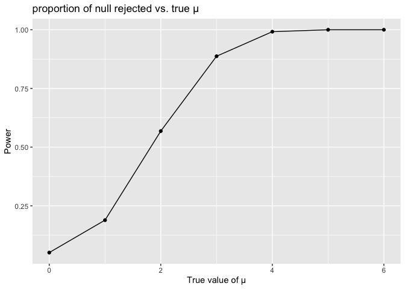
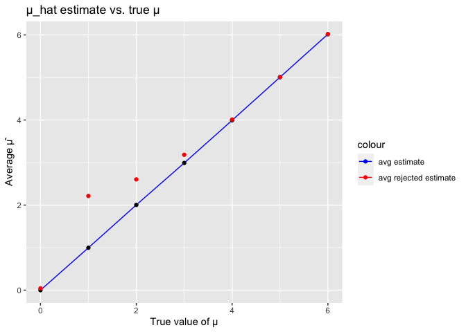

p8105_hw5_sw3879
================
Siqing Wang
2023-11-11

## Problem 1

Read in the raw data, create a new `city_state` variable

``` r
homicide = read.csv("data/homicide-data.csv") |> 
  janitor::clean_names() |> 
  mutate(
    city_state = paste(city, state, sep = ", ")
  )
```

The raw dataset has 52179 observations and 13 variables, which are uid,
reported_date, victim_last, victim_first, victim_race, victim_age,
victim_sex, city, state, lat, lon, disposition, city_state

Summarize within cities

``` r
homicide_summary = homicide |> group_by(city_state) |> 
   summarize(total_homicides = n(),
             unsolved_homicides = sum(disposition %in% c("Closed without arrest", "Open/No arrest"))
   )

homicide_summary
```

    ## # A tibble: 51 × 3
    ##    city_state      total_homicides unsolved_homicides
    ##    <chr>                     <int>              <int>
    ##  1 Albuquerque, NM             378                146
    ##  2 Atlanta, GA                 973                373
    ##  3 Baltimore, MD              2827               1825
    ##  4 Baton Rouge, LA             424                196
    ##  5 Birmingham, AL              800                347
    ##  6 Boston, MA                  614                310
    ##  7 Buffalo, NY                 521                319
    ##  8 Charlotte, NC               687                206
    ##  9 Chicago, IL                5535               4073
    ## 10 Cincinnati, OH              694                309
    ## # ℹ 41 more rows

Estimate the proportion of homicides that are unsolved in Baltimore MD

``` r
baltimore_test = prop.test(
  homicide_summary |> filter(city_state == "Baltimore, MD") |> pull(unsolved_homicides),
  homicide_summary |> filter(city_state == "Baltimore, MD") |> pull(total_homicides)
) |>  broom::tidy()
```

The estimated proportion of unsolved homicides is 0.6455607. The
confidence interval is \[0.6275625, 0.6631599\].

Run prop test for each city

``` r
nested_summary = homicide_summary %>%
  nest(total_homicides, unsolved_homicides)
```

    ## Warning: Supplying `...` without names was deprecated in tidyr 1.0.0.
    ## ℹ Please specify a name for each selection.
    ## ℹ Did you want `data = c(total_homicides, unsolved_homicides)`?
    ## Call `lifecycle::last_lifecycle_warnings()` to see where this warning was
    ## generated.

``` r
all_cities_test = nested_summary %>%
  mutate(test_result = map(data, ~ prop.test(.x$unsolved_homicides, .x$total_homicides)))
```

    ## Warning: There was 1 warning in `mutate()`.
    ## ℹ In argument: `test_result = map(data, ~prop.test(.x$unsolved_homicides,
    ##   .x$total_homicides))`.
    ## Caused by warning in `prop.test()`:
    ## ! Chi-squared approximation may be incorrect

``` r
all_cities_tidy = all_cities_test |> mutate(
    estimate = map_dbl(test_result, ~.x$estimate),
    conf_interval = map(test_result, glance),
    conf_interval_low = map_dbl(conf_interval, "conf.low"),
    conf_interval_high = map_dbl(conf_interval, "conf.high")
  ) %>%
  select(city_state, estimate, conf_interval_low, conf_interval_high) |> 
  filter(!estimate == 0)
```

Create a plot

``` r
all_cities_tidy |> 
  mutate(city_state = fct_reorder(city_state,estimate))|>
  ggplot(aes(x = city_state, y = estimate)) + 
  geom_errorbar(aes(ymin = conf_interval_low, ymax = conf_interval_high)) +
  geom_point() +
  theme(axis.text.x=element_text(angle = 45,hjust = 1)) +
  labs(title = "Estimates and Confidence Intervals for Unsolved Homicides by City",
       x = "City, State",
       y = "Estimated Proportion of Unsolved Homicides") +
  theme(axis.text.x = element_text(size = 7))
```

<!-- -->

## Problem 2

Get file names and read in data

``` r
file_names = list.files("hw5_data", full.names = TRUE)
q2_raw = map(file_names, read.csv)
q2_combined = map2(file_names, q2_raw, ~mutate(.y, file_name = .x)) |> 
  bind_rows()
```

Tidy the dataset

``` r
q2_tidy = q2_combined |> 
  separate(file_name, into = c("path", "file"), sep = "/") |> 
  separate(file, into = c("arm", "id"), sep = "_|\\.") |> 
  select(-path) |> 
    pivot_longer(
    cols = starts_with("week_"),
    names_to = "week", 
    values_to = "value"  
  ) |> 
  mutate(week = substr(week, 6, 7)) |> 
  mutate(week = as.numeric(week)) |> 
  mutate(
    arm = case_match(
      arm,
      "con" ~ "Control",
      "exp" ~ "Experimental"
    )
  )
```

    ## Warning: Expected 2 pieces. Additional pieces discarded in 20 rows [1, 2, 3, 4, 5, 6, 7,
    ## 8, 9, 10, 11, 12, 13, 14, 15, 16, 17, 18, 19, 20].

Making the spaghetti plot

``` r
q2_tidy |> ggplot(aes(x = week, y = value, color = arm)) +
  geom_line() +
  facet_wrap(~id) +
  labs(title = "Control vs. Experiment data for each arm",
       x = "Week",
       y = "Data Value")
```

<!-- -->

## Problem 3

Set up experiment

``` r
n = 30
sigma = 5
mu_values = 0:6
reps = 5000
power_results = data.frame()
estimate_results = data.frame()
```

Set up function

``` r
test_func = function(data, true_mu = 0) {
  t_test_result = tidy(t.test(data, mu = true_mu))
  p_value = t_test_result$p.value
  estimate = t_test_result$estimate
  
  return(list(p_value = p_value, estimate = estimate))
}
```

Run the function

``` r
for (mu in mu_values) {
  rejected_count = 0
  rejected_estimates = c()
  estimates = c()
  
  for (i in 1:reps) {
    data = rnorm(n, mean = mu, sd = sigma)
    test_result = test_func(data)
    
    if (test_result$p_value < 0.05) {
      rejected_count = rejected_count + 1
      rejected_estimates = c(rejected_estimates, test_result$estimate)
    } else {
      estimates = c(estimates, test_result$estimate)
    }
  }
  
  power = rejected_count / reps
  
  power_results = rbind(power_results, data.frame(mu = mu, power = power))
  
  if (length(rejected_estimates) > 0) {
    avg_estimate_rejected = mean(rejected_estimates)
  } else {
    avg_estimate_rejected = NA
  }
  
  if (length(estimates) > 0) {
    avg_estimate = mean(estimates)
  } else {
    avg_estimate = NA
  }
  
  estimate_results = rbind(estimate_results, data.frame(mu = mu, avg_estimate = avg_estimate, avg_estimate_rejected = avg_estimate_rejected))
}
```

``` r
ggplot(power_results, aes(x = mu, y = power)) +
  geom_line() +
  labs(x = "True value of μ", y = "Power") +
  geom_hline(yintercept = 0.8, linetype = "dashed", color = "red") +
  theme_minimal()
```

<!-- -->

``` r
ggplot(estimate_results, aes(x = mu, y = avg_estimate)) +
  geom_line() +
  labs(x = "True value of μ", y = "Average μ̂") +
  geom_point(data = estimate_results[!is.na(estimate_results$avg_estimate_rejected), ], aes(y = avg_estimate_rejected), color = "red") +
  theme_minimal()
```

    ## Warning: Removed 1 row containing missing values (`geom_line()`).

<!-- -->
